# GitHub Stats

Premium GitHub statistics SVG cards — auto-generated every 12 hours.

Minimal. Monochrome. Monospace.

---

## Cards

### Contributions


### Streak


### Languages



---

## Setup

### 1. Create a GitHub PAT

Go to **Settings → Developer Settings → Personal Access Tokens → Fine-grained tokens** and create a token with **read-only** access.

### 2. Add repository secret

Go to **Repo → Settings → Secrets and variables → Actions → New repository secret**

- Name: `GH_TOKEN`
- Value: your token

### 3. Run locally (optional)

```bash
# Set token
set GH_TOKEN=ghp_your_token_here       # Windows
export GH_TOKEN=ghp_your_token_here     # macOS / Linux

# Install and generate
npm install
npm run generate
```

SVGs will be written to the `output/` directory.

---

## Architecture

```
src/
├── api/github.js          ← GraphQL fetch → clean stats object
├── generators/
│   ├── contribution.js    ← Stats → contribution.svg
│   ├── streak.js          ← Stats → streak.svg
│   └── languages.js       ← Stats → languages.svg
├── utils/
│   ├── colors.js          ← Color palette
│   ├── svg.js             ← SVG helpers
│   └── graph.js           ← Path math
└── index.js               ← Orchestrator
```

---

## Design

- **Background**: `#0d1117` (GitHub Dark)
- **Surface**: `#161b22`
- **Typography**: System monospace stack
- **Animations**: CSS keyframes embedded in SVG
- **No gradients. No glassmorphism.**

---

## License

MIT
